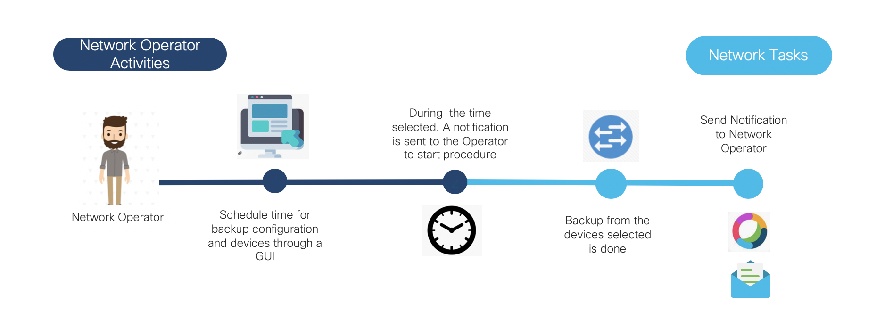
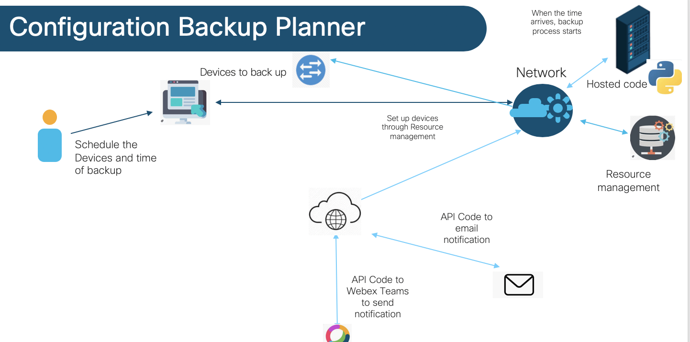
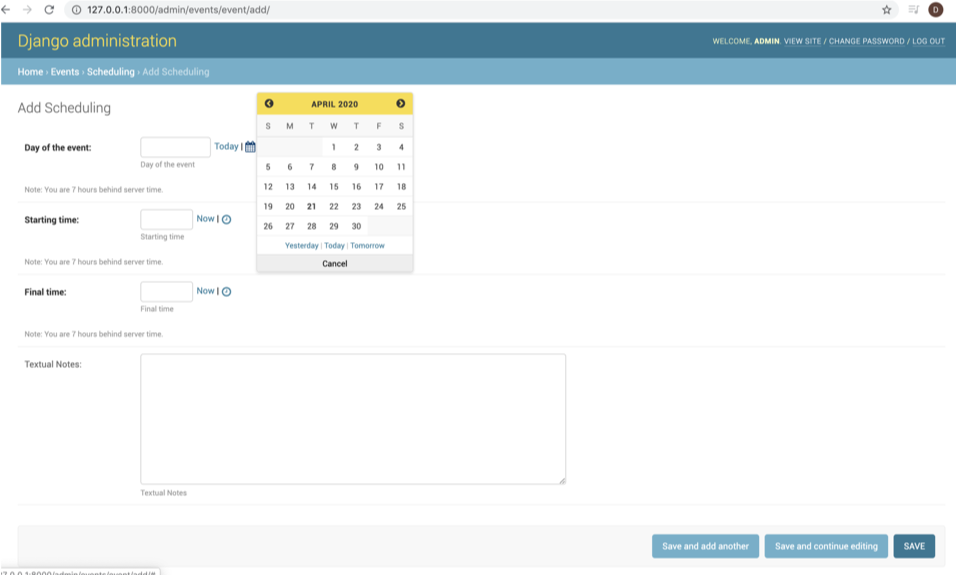

# ConfigurationBackupPlanner


## Contacts
* Daria Shantalova (dshantal@cisco.com)

## Solution Components
* Meraki API ver 0 https://documentation.meraki.com/zGeneral_Administration/Other_Topics/The_Cisco_Meraki_Dashboard_API
* Django 1.11.19
* Celery v4.4.2
* Webex Teams ver 3.0 https://developer.webex.com/
* Python 3.7

## Business Needs and Challenges
- 	Employees from IT area spend too much time making backup configuration on each device
- 	Create a simpler and automatic way to backup device’s configuration without IT staffing intervention.

## Solution
- This demo utilizes WebEx teams, Cisco Meraki and Django to build a configuration backup planner which can be used by employees of an organization to scheduler a configuration backup for all devices to certain date and time.

## Business Outcomes
- Reduce time network engineers spend on saving configuration per device
- Automate process of organizing configuration backups


## PoV description

- Network engineer goes to web page and schedule date and time for the start of backup configuration via user’s interface
- All scheduled events are stored. On time the script uses Meraki APIs  to save configuration on all devices
- The Configuration Backup Planner will create notification in Webex Teams as soon as backup is done

## Architecture


## Launching the PoV:

-	The application is based on django. django>=1.11.19
- Download the code.
- Install modules for Meraki.
```shell
pip install requests
pip install meraki-sdk
pip install -U python-dotenv
```
- Get yourself an Meraki API Key. https://documentation.meraki.com/zGeneral_Administration/Other_Topics/The_Cisco_Meraki_Dashboard_API
- Next you need to create a ".meraki.env" file in your home directory (special note for Windows users - the filename is dot meraki dot env).  This is used to store your sensitive information.  If you are a Windows user and you go Windows+R  and type in "cmd" and hit return you'll have a command prompt with the current directory equal to your home directory.  From here you can go "notepad .meraki.env" to create the file.  A sample might look like:
```shell
x_cisco_meraki_api_key=****************
```
- Enter org name in https://wwwin-github.cisco.com/gve/ConfigurationBackupPlanner/blob/master/events/tasks.py
-  Install celery
- Run commands
```shell
python manage.py migrate
python manage.py createsuperuser
python manage.py runserver
```
Head over to http:localhost:8000/admin and sign in with your admin credential (defined above).

Part of the code in this repo took from reference the script shared https://www.ifm.net.nz/cookbooks/meraki-backup.html


### License

Provided under Cisco Sample Code License, for details see [LICENSE](./LICENSE.md)

### Code of Conduct

Our code of conduct is available [here](./CODE_OF_CONDUCT.md)

### Contributing

See our contributing guidelines [here](./CONTRIBUTING.md)


#### DISCLAIMER:

<b>Please note:</b> This script is meant for demo purposes only. All tools/ scripts in this repo are released for use "AS IS" without any warranties of any kind, including, but not limited to their installation, use, or performance. Any use of these scripts and tools is at your own risk. There is no guarantee that they have been through thorough testing in a comparable environment and we are not responsible for any damage or data loss incurred with their use.
You are responsible for reviewing and testing any scripts you run thoroughly before use in any non-testing environment.

